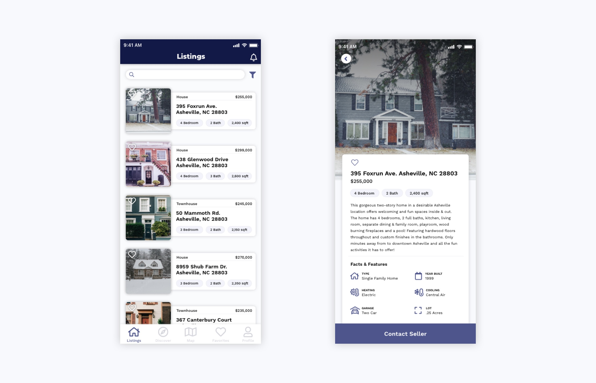

# estateApp
Projenin son halinin görünümü:


# Kullandığım Kütüphaneler
Sayfalar arası geçişi(TabNavigator) sağlamak için => [React-Navigation](https://reactnavigation.org/),<br/>
State yönetimi için => [Redux](https://redux.js.org/),<br/>
Oluşturduğum REST API den verileri çekmek için => [Axios](https://www.npmjs.com/package/axios),<br/>
Anlık bildirim için => [Push Notification](https://www.npmjs.com/package/react-push-notification),<br/>
Hazır Icon için => [Vector Icons](https://www.npmjs.com/package/react-native-vector-icons),<br/>

# Projeyi Çalıştırma
#### Android
Önce API'yi ayağa kaldırmak gerekiyor: <br/>
```
Node server.js
```

Ardından emilatörü: <br/>
```
yarn react-native run-android --port 8082
```
#### IOS
Çalışmaz malesef kütüphanelerin IOS gereksinimlerini eklemedim. MAC'im olmadığı için...

